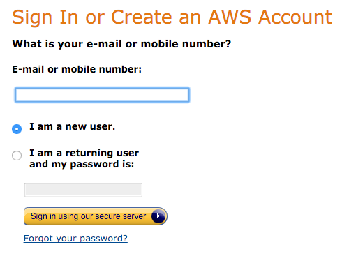
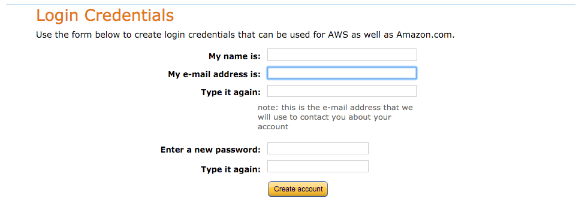
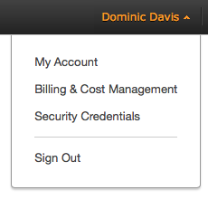
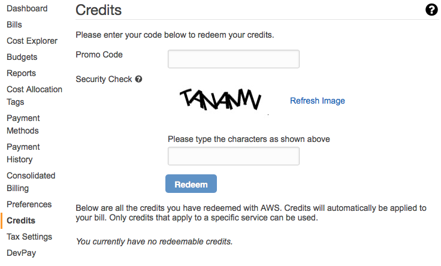

# Exercise 1

## Create an AWS account

During this event we're going to be using Amazon Web Services, or AWS. AWS have provided us with &#36;50 worth of credit per student. This entire event is unlikely to cost more than a few dollars so the remaining credit is yours to use as you like.

If you've already got an AWS account skip to the section on **Applying Your Credit**.

### Sign Up

Head to the AWS website at [https://aws.amazon.com/](https://aws.amazon.com/) and click `Create an AWS Account`.

Enter your email address and click `Sign in using our secure server`.

Enter in your _Login Credentials_ and click `Create Account`.

You will now be asked to provide a number of details to finish creating your account. This will include payments details, however, no payments will be taken from your card. At the end of the event you are free to cancel your account at any time.

### Applying Your Credit

If you're not already signed into your AWS account, sign in at [https://aws.amazon.com/console/](https://aws.amazon.com/console/).

Click on your name to the top right and select `My Account`. A new page will open showing your account details. Select `Credits` and enter in the code you've been given along with the security check.

Click `Redeem`.

You're now set up with &#36;50 worth of credit.
