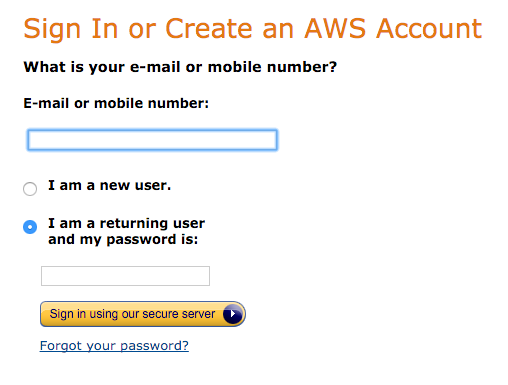
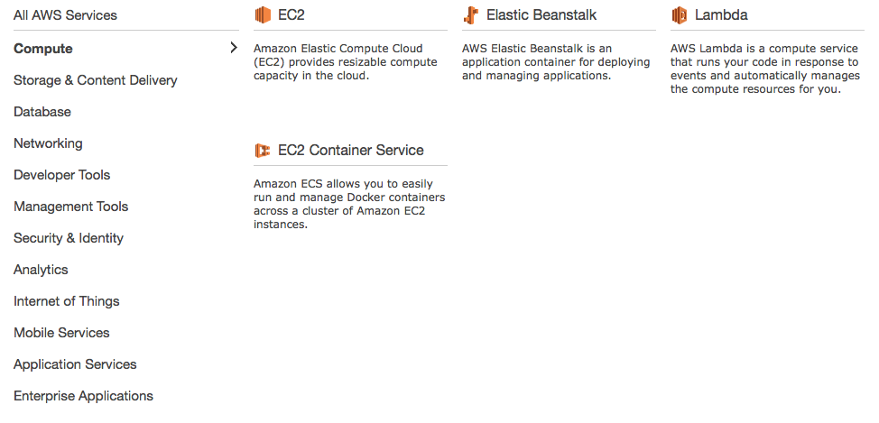
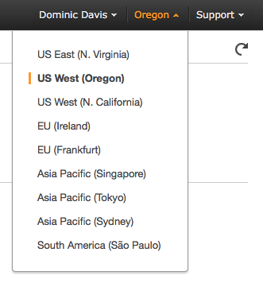
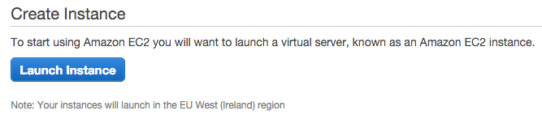
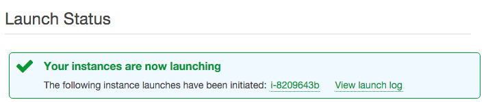
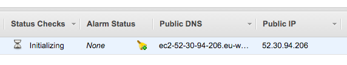

# Exercise 2

## Creating an EC2 Instance

In this exercise we're going to look at creating an Amazon Elastic Compute Cloud, or EC2 instance on AWS. This exercise will require access to the AWS Web Console and an SSH client to test the connection.

### Log in to the AWS Web Console

If you're not already logged in, go to [https://aws.amazon.com/console/](https://aws.amazon.com/console/), click `Sign into the AWS Console` and enter your login details.

>Note: Depending on how you account is set up, you may need to enter a second authentication code to proceed. 

You'll now likely be presented with a large list of services to choose from. If you are not select the `Services` menu from the top of the page.

We're interested in `EC2` which can be found under `Compute`. Selecting this will take us to the `EC2 Dashboard`. 

EC2 instances can be created in a number of different regions. The default is Oregon. Since we're in the UK select `EU (Ireland)` from 
the menu on the top right.

### Launch Instance

We're now ready to launch an EC2 instance. To make things easier, we're going to use a lot of defaults, but it is possible to use services like VPC (Virtual Private Cloud) and IAM Roles to configure and network topology and setup you could want.

Click the Launch Instance button which should be in the middle of your `EC2 Dashboard`.

Select the `Amazon Linux` AMI from the top of the `Quick Start` list provided. EC2 instances can run a huge array of operating systems configured with different software. For now we're just using a fairly generic image.

Leave the General Purpose `t2.micro` instance type selected. EC2 instances can be configured for different compute loads (CPU, Network and I/O) and different costs. `t2.micro` instances are great for playing around, plus they're cheap to run - even free in some cases.

Click `Review and Launch`

The default configuration allows you to access the machine from anywhere in the world. This is fine for our workshop, but in production environments security groups would be used to secure the instance and reduce the risk of unauthorised access.

Click `Launch`

We now need to create an SSH key pair to allow us to securely connect to our machine. Select `Create new key pair` from the dialog that has appeared and enter in `AWS-Workshop` as the name.

Click `Download Key Pair`, then `Launch Instance`.

You should now have a `Launch Status` page giving some details of your newly launched instance. Clicking the instance ID (the green link starting with `i-` will show you some details of your new machine, including the Public IP address. Make a note of this address. 

While your machine is launching we'll convert your SSH key into something PuTTY can use.
